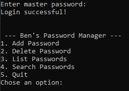
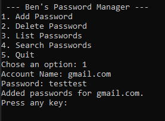
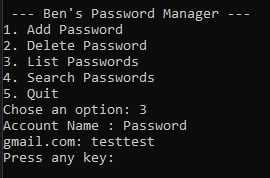

# Bens Passwort-Manager

Dies ist ein einfacher Passwort-Manager, den ich erstellt habe, um Erfahrung mit Verschlüsselung zu sammeln. Er verwendet die Python `cryptography` Bibliothek: `Fernet` für das Verschlüsseln/Entschlüsseln von Passwörtern und `hazmat` für die Erstellung eines sicheren Master-Passwort.

Beim ersten Start muss der Benutzer ein Master Passwort eingeben. Falls keines existiert, wird eines erstellt und in `master.key` gespeichert. Dieser Schlüssel wird dann von `Fernet` verwendet, um die Passwort Datei `passwords.dat` zu verschlüsseln bzw. zu entschlüsseln.

Nach dem Login kann der Benutzer:
- Passwörter hinzufügen
- Alle Passwörter anzeigen
- Passwörter löschen
- Passwörter suchen  

> Wird das Master Passwort vergessen, gibt es keine Möglichkeit, es wiederherzustellen.  
> Das Löschen von `master.key` setzt die Anwendung zurück, sodass ein neues Master-Passwort erstellt werden kann und die Passwortliste leer beginnt.

## Textual GUI Version

Ursprünglich dachte ich, dass Textual perfekt wäre, um eine einfache GUI für dieses Skript zu erstellen. Theoretisch stimmt das auch. In der Praxis erwies es sich jedoch als deutlich komplizierter als erwartet, weshalb ich es wahrscheinlich nicht erneut aufgreifen werde. Da viel Arbeit hineingeflossen ist, habe ich es trotzdem hier aufgenommen, aber das Hauptprojekt bleibt die CLI-Version.

## Screenshots
**Menü:**

